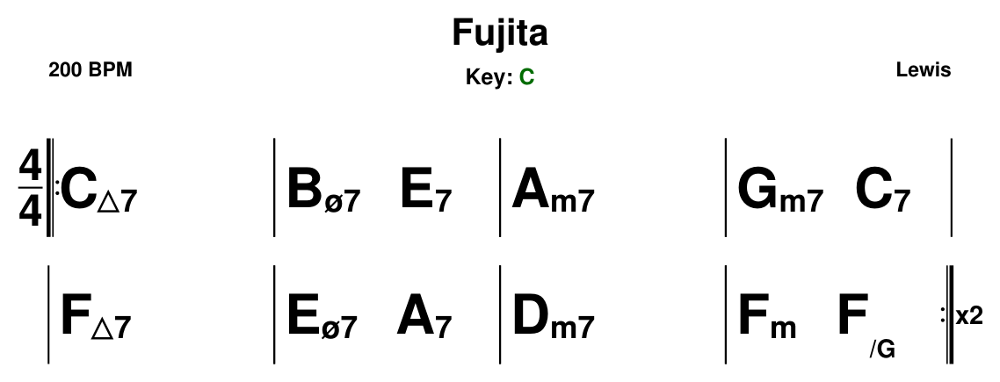

# Acordes → PDF + MIDI

Convierte una progresión de acordes en una **lead sheet PDF** (estilo Real Pro) y en un **MIDI** con voice leading.

**▶ Web: https://yagoestudios.github.io/acordes-pdf-midi/**

Entrada: un enlace Real, un archivo `.musicxml`/`.xml`, o un `.txt` propio. Todo se normaliza a un `.txt` y de ahí salen el PDF y el MIDI.

## Cómo queda

Este `.txt`:

```
tune="Fujita"
artist="Lewis"
key="C"
sig="4/4"
bpm=200

= x2
Cmaj7 Bm7b5_E7 Am7 Gm7_C7
Fmaj7 Em7b5_A7 Dm7 Fm_F/G
```

produce este PDF:



## Uso (web)

1. Abre la web.
2. Pega un enlace, sube un `.musicxml`/`.txt`, o pega el texto de un `.txt`.
3. (Opcional) *Transponer a* y *BPM*.
4. Salida: **Completo** (`.zip` con txt + fuente + pdf + mid) o **Solo PDF** / **Solo MIDI**.
5. **Generar**.

## Uso local (opcional)

App de escritorio con la misma lógica (`local.py`):

```bash
pip install reportlab pychord midiutil pyRealParser customtkinter

python local.py                  # interfaz gráfica
python local.py micancion.txt    # CLI (.txt / .musicxml / enlace)
```

Crea `salida/<Cancion>/` con el `.txt`, la fuente, el `.pdf` y el `.mid`.

---

# Formato del `.txt`

## Cabecera

Una línea por variable, `clave=valor`, al principio del archivo. Todas opcionales. **Valores entre comillas salvo `bpm`.** Luego una línea en blanco y los acordes.

| Clave | Por defecto | Qué hace |
|-------|-------------|----------|
| `tune` | `cancion` | título; nombra carpeta y archivos |
| `artist` | (vacío) | compositor (arriba a la derecha) |
| `bpm` | `120` | tempo del MIDI (sin comillas) |
| `key` | (vacío) | tonalidad (`Eb`, `Gm`, `F#m`…); necesaria para transponer |
| `sig` | `4/4` | compás; reparte los beats en el MIDI |
| `trans` | (vacío) | transpone (ver abajo) |

## Acordes

- **Un acorde = un compás.** Separados por espacios.
- **Cada línea = una fila** del PDF.
- **`_`** une acordes en el **mismo compás**, repartiendo beats: en 4/4, `Dm7_G7` = 2 beats cada uno.
- **`nan`** (o `n`) es un hueco: en el PDF deja espacio vacío; en el MIDI el acorde anterior sigue sonando ese beat. `Am_nan_Dm_G` en 4/4 = Am 2, Dm 1, G 1.

## Secciones y repetición

Una línea que **empieza por `=`** marca una sección (su etiqueta se dibuja sobre la fila siguiente). Añade **`xN`** para repetirla N veces (en PDF y MIDI):

```
= A x2
C Am F G

= B
Dm7 G7 C C
```

A sale dos veces, B una.

## Transponer

`trans=` mueve todos los acordes y la `key`. **Requiere `key` definida.** También hay campo "Transponer a" en la web.

- **Tonalidad destino**: `trans=Gm`, `trans=Db`, `trans=Abmin`…
- **Semitonos**: `trans=+3`, `trans=-2`.
- **Grados** (números romanos): `trans=grados` → mayúscula = mayor, minúscula = menor, `°` disminuido, `ø7` semidisminuido. El MIDI sigue sonando los acordes reales.

La calidad mayor/menor la manda el tema de origen; si pides la otra, se usa su relativa (misma armadura). El PDF/MIDI salen con el tono en el nombre: `Fujita (Gm).pdf`.

## Notación de acordes

Notación legible normal; el PDF los convierte a símbolos:

| Escribes | PDF | |
|----------|-----|--|
| `Cmaj7` | `C△7` | mayor séptima |
| `Dm7` | `Dm7` | menor séptima |
| `Ddim7` | `D°7` | disminuido |
| `Dm7b5` | `Dø` | semidisminuido |
| `G7` | `G7` | dominante |
| `F/G` | `F/G` | slash chord |

El `.txt` guarda siempre los nombres legibles (`Dm7b5`) para que el MIDI funcione; los símbolos `△ ° ø` son solo del PDF.
